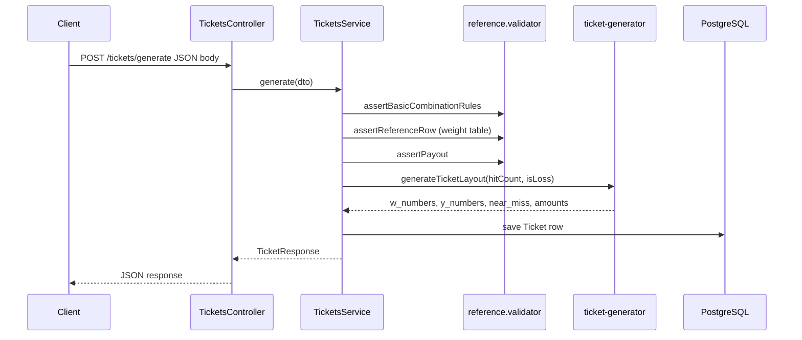

# Single Ticket Generator — Developer Guide

This document explains **what the service does**, **how the code is organized**, and **how ticket generation works** end to end. It is written for developers who are new to this repository or to NestJS.

---

## What this service does

For **one HTTP request**, the API:

1. Accepts a **player id**, **bet amount**, **multiplier**, and **combination** (array of numbers).
2. **Validates** that the payload is consistent with the product rules and with the **canonical weight table** (`weight-table.json`).
3. **Generates** a single scratch-style ticket: **5 “W” numbers**, **20 “Y” numbers**, optional **near-miss** positions (losing tickets only), and a **20-cell amount layout**.
4. **Persists** the ticket in PostgreSQL.
5. **Returns** the ticket to the client (without re-shuffling stored data).

If any generation rule fails, the engine **retries up to 10 times** with a fresh random draw (mainly a new **W** set). If it still fails, the API responds with an error.

---

## Tech stack

| Piece      | Technology                           |
| ---------- | ------------------------------------ |
| Framework  | NestJS                               |
| Language   | TypeScript (strict)                  |
| HTTP       | `@nestjs/platform-express`           |
| Database   | PostgreSQL                           |
| ORM        | TypeORM                              |
| Validation | `class-validator` + `ValidationPipe` |

---

## Project structure

High-level layout (under `src/`):

```
src/
├── main.ts                    # Bootstraps Nest, global ValidationPipe, port
├── app.module.ts              # Root module: Config, TypeORM, TicketsModule
├── config/
│   └── database.config.ts     # TypeORM connection from env vars
└── tickets/
    ├── tickets.module.ts      # Wires controller, service, TypeORM entity
    ├── tickets.controller.ts  # HTTP routes
    ├── tickets.service.ts     # Orchestrates validation → generate → save → map response
    ├── dto/
    │   └── generate-ticket.dto.ts   # Request body shape + validation decorators
    ├── entities/
    │   └── ticket.entity.ts         # `tickets` table mapping
    ├── data/
    │   └── weight-table.json        # Canonical multiplier + combination rows
    ├── validation/
    │   ├── reference.validator.ts   # Basic rules + weight-table lookup
    │   ├── weight-table.ts        # Loads JSON from disk (dev + dist paths)
    │   └── numeric.utils.ts       # Float-safe sum / equality helpers
    ├── engine/
    │   ├── ticket-generator.ts    # Retry loop, calls scratch + amount engines
    │   ├── scratch-grid.engine.ts # W / Y / near-miss construction
    │   ├── amount-layout.engine.ts# 20 prize amounts + near-miss amount priority
    │   └── ticket-checksum.ts     # Mod-97 check digits for `ticket_no`
    ├── types/
    │   └── win-tier.ts            # Shared tier type aliases
    └── utils/
        └── random.utils.ts        # shuffle, random int, sampling helpers
```

**How to read the code in order**

1. `main.ts` → see global pipes and port.
2. `tickets.controller.ts` → see the single endpoint.
3. `tickets.service.ts` → see the **full business flow** (validation → generation → DB).
4. `reference.validator.ts` + `weight-table.json` → see **why** some requests are rejected.
5. `ticket-generator.ts` → see **retries** and how scratch + amounts connect.
6. `scratch-grid.engine.ts` and `amount-layout.engine.ts` → see **random generation rules**.

---

## Request flow (big picture)



---

## HTTP API

### Endpoint

| Method | Path                | Description       |
| ------ | ------------------- | ----------------- |
| `POST` | `/tickets/generate` | Create one ticket |

The app listens on **`PORT`** (default **3000**). There is no global prefix (e.g. no `/api`).

### Request body (`GenerateTicketDto`)

| Field         | Type     | Required | Notes                                                        |
| ------------- | -------- | -------- | ------------------------------------------------------------ |
| `player_id`   | string   | yes      | Stored on the ticket row.                                    |
| `bet_amount`  | number   | yes      | Must be **> 0**.                                             |
| `multiplier`  | number   | yes      | Must be **≥ 0**.                                             |
| `combination` | number[] | yes      | Must be **empty** if `multiplier === 0`, else **non-empty**. |
| `bet_tier`    | number   | no       | Accepted if sent; not persisted in the current schema.       |

Extra properties in the JSON body are **rejected** (`forbidNonWhitelisted: true` on `ValidationPipe`).

### Derived fields (conceptual)

- **`hit_count`** = `combination.length` (after reference validation).
- **`win_tier`** = from the matched weight-table row (and consistent with multiplier bands).
- **`payout`** = `multiplier × bet_amount` (computed after validation).

### Successful response (shape)

The service returns JSON like:

```json
{
  "ticket_no": "NO.20250327-01AR3...ULID...-42",
  "multiplier": 1.5,
  "win_tier": "WIN",
  "hit_count": 1,
  "payout": 3,
  "w_numbers": ["03", "17", …],
  "y_numbers": ["…20 strings…"],
  "amount_layout": {
    "amounts": [1.5, 5, 200, …]
  }
}
```

- **`amount_layout`** in the response only exposes **`amounts`** (length 20, index = cell position).
- The database also stores **`tiers`** per cell inside `amount_layout` JSON for integrity checks.

### Example calls

**Losing ticket (`NO_WIN`)** — `multiplier` 0, empty combination:

```bash
curl -s -X POST http://localhost:3000/tickets/generate \
  -H "Content-Type: application/json" \
  -d "{\"player_id\":\"demo\",\"bet_amount\":2,\"multiplier\":0,\"combination\":[]}"
```

**Winning ticket** — must match a row in `weight-table.json` exactly (same multiplier and same combination multiset):

```bash
curl -s -X POST http://localhost:3000/tickets/generate \
  -H "Content-Type: application/json" \
  -d "{\"player_id\":\"demo\",\"bet_amount\":2,\"multiplier\":1.5,\"combination\":[1.5]}"
```

### Common HTTP status codes

| Status | Meaning                                                                                                                                        |
| ------ | ---------------------------------------------------------------------------------------------------------------------------------------------- |
| `200`  | Success. (This handler does not set `@HttpCode(201)`, so Nest uses the default **200** for `POST`.)                                            |
| `400`  | Validation failed (`class-validator`) or **reference** validation (`BadRequestException`: bad sum, unknown multiplier/combination pair, etc.). |
| `503`  | Generation failed after **10** full attempts (`ServiceUnavailableException`).                                                                  |

---

## Validation logic (before any randomness)

Implemented mainly in `reference.validator.ts` and `numeric.utils.ts`.

1. **Basic rules**
   - `bet_amount > 0`
   - `multiplier >= 0`
   - If `multiplier === 0`, `combination` must be `[]`.
   - If `multiplier > 0`, `combination` must be non-empty.
   - **Sum** of `combination` must equal `multiplier` (float-safe tolerance).

2. **Reference table**
   - `weight-table.json` lists every allowed **`multiplier` + `combination`** pair (order of elements in `combination` does not matter; comparison uses a normalized “fingerprint”).
   - If there is **no matching row**, the request is rejected. This prevents arbitrary payout shapes.

3. **Payout**
   - `payout = multiplier * bet_amount` (sanity check for finite number).

---

## Ticket generation logic

### 1. Retry loop (`ticket-generator.ts`)

`generateTicketLayout(hitCount, isLoss)` runs up to **`MAX_GENERATION_ATTEMPTS` (10)** times:

1. Try to build **W + Y** (+ near-miss for losses) via `tryBuildScratchGrid`.
2. Build **amount layout** with `buildAmountLayout(nearMissPositions)`.
3. Run **`assertScratchValid`** and **`assertAmountLayoutValid`**.
4. If anything throws or scratch returns `null`, **start over** (new random **W**, etc.).

So: **no ticket is returned until all checks pass**.

### 2. Scratch grid — W and Y (`scratch-grid.engine.ts`)

- **W area**: exactly **5** distinct values, each a **two-digit string** `"00"`–`"99"`, uniform random.
- **Y area**: exactly **20** distinct values, same format, **globally unique** (no duplicates in Y).

**Winning tickets** (`multiplier > 0`):

- Pick **`hitCount`** distinct values from **W** and place them on **random distinct positions** in the 20 Y cells.
- Fill the other Y cells with values that are **not** in **W**, so you do not create extra accidental “hits”.

**Losing tickets** (`NO_WIN`):

- **Y** must **not** contain any **W** value.
- **Near-miss**: pick **3–4** W values as sources; for each, candidate values are:
  - `W === "00"` → only `"01"`
  - `W === "99"` → only `"98"`
  - else → **`W−1`** and **`W+1`** as two-digit strings
- Choose **4–8** near-miss **positions** and assign **unique** near-miss values (never equal to any **W**, never duplicated in **Y**).
- Fill remaining cells with random unused labels disjoint from **W** and from already used **Y** values.

If a draw cannot satisfy constraints, that attempt fails and the outer loop retries.

### 3. Amount layout (`amount-layout.engine.ts`)

The 20 monetary cells follow band rules:

- **Low** — 4 cells, values from a fixed low pool; **2–4 distinct denominations** used across those cells (duplicates allowed).
- **Medium** — 4 cells, same idea with the medium pool.
- **High** — 6 cells, same idea with the high pool.
- **Jackpot** — 6 cells, **exactly 2 distinct** denominations from the jackpot pool (the pool has two values, so both are used).

**Near-miss amount priority** (only relevant when there **are** near-miss indices):

- When placing amounts, **near-miss cell indices** are filled first using a priority ladder: **Jackpot → High → Medium → Low**, up to **two** assignments per tier when stock exists.
- Remaining cells receive the rest of the multiset in shuffled order.

After construction, **`assertAmountLayoutValid`** verifies counts per tier, pool membership, and the jackpot two-denomination rule.

### 4. Ticket number (`ticket-checksum.ts`)

- **`id`**: ULID (primary key).
- **`ticket_no`**: `NO.{YYYYMMDD}-{ULID}-{checksum}`
  - Date is **UTC** from `new Date().toISOString()`.
  - **Checksum**: two digits from a **mod 97** style calculation on the alphanumeric payload (see implementation for exact expansion rules).

---

## Database

- **Table**: `tickets` (see `ticket.entity.ts`).
- **Important columns**: `w_numbers`, `y_numbers`, `near_miss_positions`, `amount_layout` (JSONB), `ticket_no` (unique), decimals for money fields.
- **Schema sync**: controlled by **`TYPEORM_SYNC`** env (`true` by default in examples for local/Docker convenience). For production, prefer migrations and set sync to `false`.

Connection settings live in **`database.config.ts`** (`DATABASE_HOST`, `DATABASE_PORT`, `DATABASE_USER`, `DATABASE_PASSWORD`, `DATABASE_NAME`). See **`.env.example`** in the repo root.

---

## Running the app (short)

1. Start PostgreSQL (local install or Docker).
2. Copy **`.env.example`** → **`.env`** and adjust if needed.
3. `npm install` then `npm run start:dev`.

**Docker Compose — database only**

If you use Compose just for Postgres, start only the `db` service so port `5432` is exposed to the host:

```bash
docker compose up db
```

Then in `.env` use **`DATABASE_HOST=localhost`** (and the same user/password/db as in `docker-compose.yml`). Run the Nest app on the host with `npm run start:dev`.

Full stack (app + db) is still: `docker compose up --build`.

---

## Glossary

| Term             | Meaning here                                                                   |
| ---------------- | ------------------------------------------------------------------------------ |
| **W numbers**    | Five “winning line” numbers shown on the ticket.                               |
| **Y numbers**    | Twenty scratch cells; subset may match W on wins.                              |
| **Near-miss**    | On a loss, some Y values are adjacent (±1) to chosen W values, not equal to W. |
| **Hit count**    | Length of `combination`; number of winning matches on Y for wins.              |
| **Weight table** | Authoritative list of legal `multiplier` + `combination` pairs.                |

---

## Related files outside `src/`

| File                 | Purpose                                 |
| -------------------- | --------------------------------------- |
| `docker-compose.yml` | Postgres + optional app container       |
| `Dockerfile`         | Production-style Node image for the API |
| `.env.example`       | Environment variable template           |
| `docs/GUIDE.md`      | This document                           |

If something in behavior and this guide disagree, **the TypeScript implementation is the source of truth**; consider updating this file when rules change.
